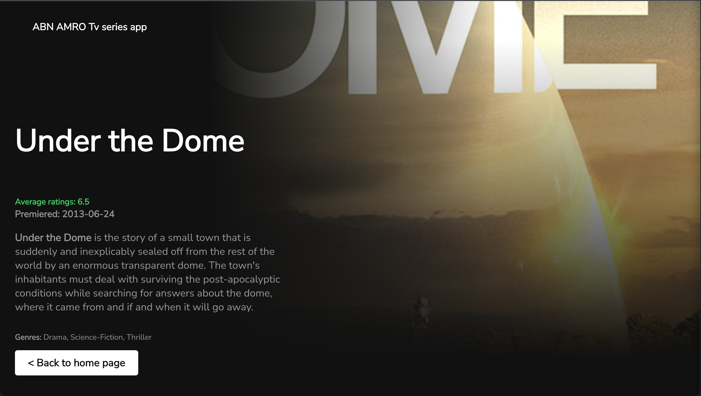
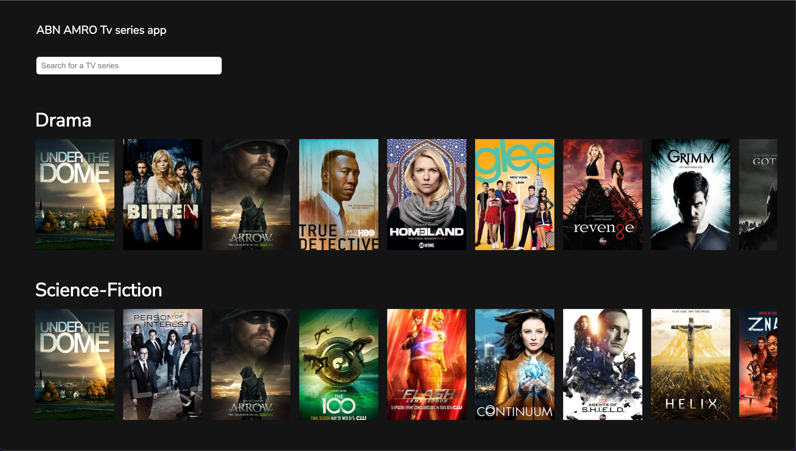
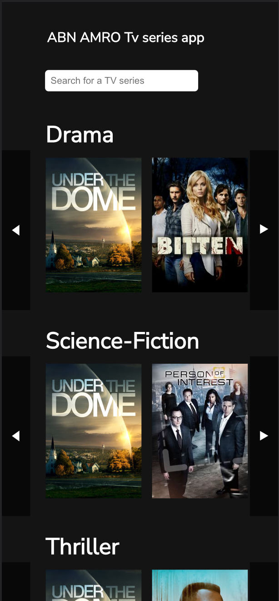
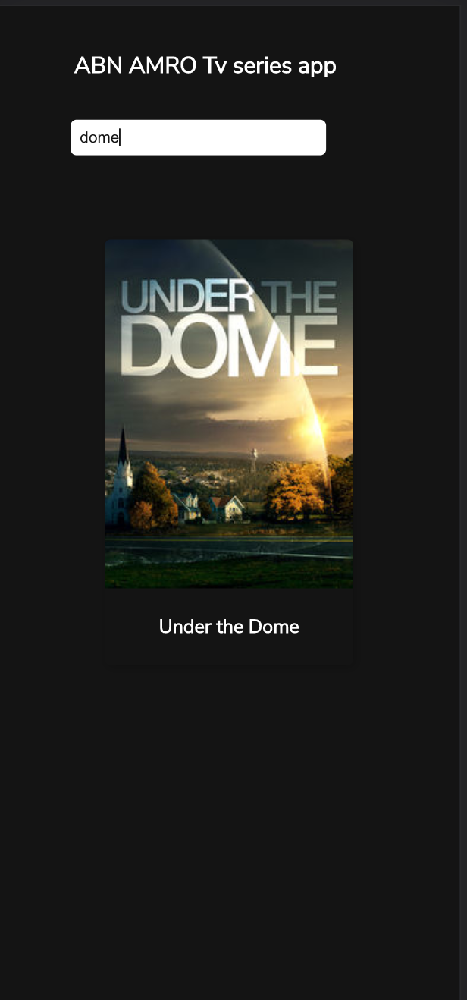

# Home Assignment
```
I choose Vue3 to create this project since likely this is what I will work with if I get hired.
I would like to emphasise that this is the first Vue3 app I created.
It is a lot of fun but of course, in this limited amount of time, 
I can not optimize it as I would otherwise.

 - I use Vue3 with a mix of new technologies Composition/Option API.
 - VueX for simple state management.
 - Typescript

Also, I ran into a few unexpected issues which in a work situation 
I would discuss with my colleges.

I hope this project and my commits represents my dedication, curiosity and problem solving skills.

```

TODO/Plan
- [x] Initiate Vue3 project
- [x] Fetch all shows from api
- [x] Render all shows in a responsive grid
- [x] Filter by name option
- [x] Filter by genre option
- [x] Style navbar
- [x] Style from
- [x] Write test for utils
- [x] Navigate to selected show page 
- [x] Display detailed info about show
- [x] Show episodes

## Project setup
```
npm install
```

### Compiles and hot-reloads for development
```
npm run serve
```

### Compiles and minifies for production
```
npm run build
```

### Run your unit tests
```
npm run test:unit
```

### Lints and fixes files
```
npm run lint
```

### Customize configuration
See [Configuration Reference](https://cli.vuejs.org/config/).


# Screenshots




